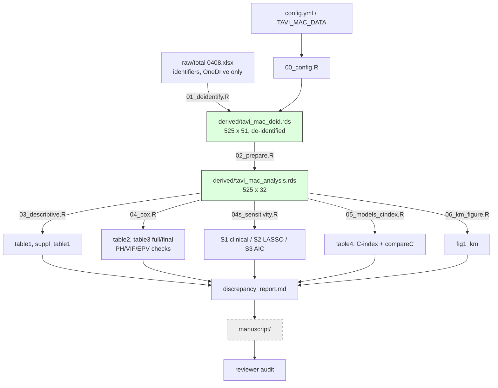

# PROGRESS — TAVI_MAC

**Resume point (for next computer):** Amendment 1 (continuous MAC primary +
median-split categories) executed; outputs in `<data_dir>/output/` (07/08
scripts). TWO DECISIONS PENDING before manuscript: (1) MR-grade handling
(discrepancy report 1c); (2) PH violation of the MAC exposure itself
(cox.zph p=0.016 continuous / 0.023 categorical) — remedy (e.g., time-interval
HRs) needs a plan amendment. Then: manuscript drafting.

## Checklist

### Stage 0 — Infrastructure (plan/setup_infra_plan.md)
- [x] Plan approved (2026-08-31)
- [x] Data moved out of repo to `~/OneDrive/Research/data/TAVI_MAC/raw/`
- [x] Config mechanism (`config/config.yml` + `TAVI_MAC_DATA` env var, `00_config.R`)
- [x] De-identification script `01_deidentify.R` run → `derived/tavi_mac_deid.rds`
- [x] git init, initial commits, pushed to GitHub (jiwonseo1430/TAVI_MAC)

### Stage 1 — Analysis plan
- [x] `plan/analysis_plan.md` written (primary = backward selection; S1–S3 sensitivity)
- [x] Plan approved (2026-08-31)

### Stage 2 — Analysis (all outputs in `<data_dir>/output/`)
- [x] `02_prepare.R` — analysis dataset (525 x 32), MAC group 269/220/36 verified
- [x] `03_descriptive.R` — table1.csv, suppl_table1.csv
- [x] `04_cox.R` — table2.csv, backward selection (table3_full/final.csv), PH/VIF/EPV
- [x] `04s_sensitivity.R` — S1/S2/S3 (sensitivity_models.csv)
- [x] `05_models_cindex.R` — table4.csv (C 0.708→0.732, ΔC p=0.061)
- [x] `06_km_figure.R` — fig1_km.png/.pdf (log-rank p<0.0001)
- [x] discrepancy_report.md (A.fib inversion, T3-2 CI typos, MR n=514, ΔC p)
- [ ] MR-grade handling decision (discrepancy 1c) — blocks Table 1 finalization

### Stage 2b — Amendment 1: continuous MAC exposure (plan Amendment 1)
- [x] 717.2 provenance established: cohort-derived maxstat cutpoint (adj p=0.012)
- [x] `02/03` updated — log2_mac, median-split groups (269/128/128), table1_medgroup
- [x] `07_continuous_primary.R` — primary log2 MAC HR 1.09 (1.04-1.15)/doubling;
      median-split Low 1.87 / High 2.02; S1-S3 all significant; C 0.719→0.736
      (p=0.197) / →0.740 categorical (p=0.085); nonlinearity p=0.008
- [x] `08_figures_continuous.R` — fig1_km_med (log-rank p=0.021), fig2_spline
- [ ] **PH violation of MAC exposure (p=0.016/0.023) — decision needed**

### Stage 3 — Manuscript
- [ ] Draft (Methods/Results first)
- [ ] Reviewer audit (review/reviewer_checklist.md)
- [ ] Submission

## Flow

