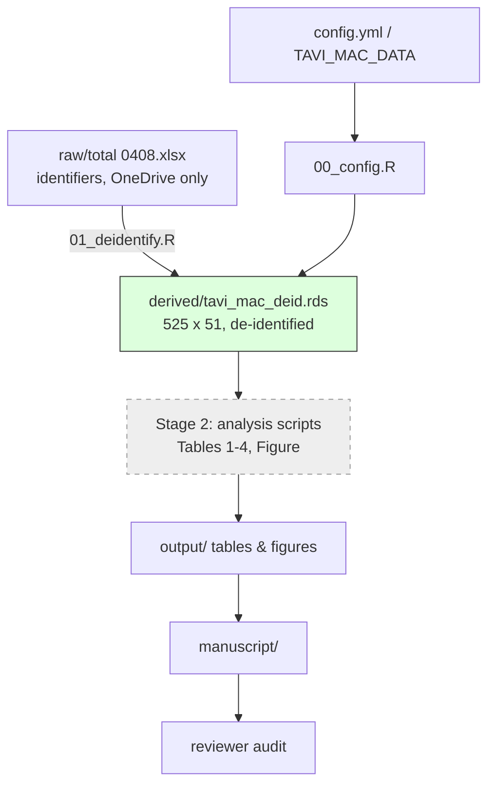

# PROGRESS — TAVI_MAC

**Resume point (for next computer):** Infrastructure setup complete; de-identified
dataset built. Next step: write the statistical analysis plan
(`plan/analysis_plan.md`) to reproduce/verify the preliminary tables in
`<data_dir>/raw/20260409 table figure-2.docx`, then get it approved.

## Checklist

### Stage 0 — Infrastructure (plan/setup_infra_plan.md)
- [x] Plan approved (2026-08-31)
- [x] Data moved out of repo to `~/OneDrive/Research/data/TAVI_MAC/raw/`
- [x] Config mechanism (`config/config.yml` + `TAVI_MAC_DATA` env var, `00_config.R`)
- [x] De-identification script `01_deidentify.R` run → `derived/tavi_mac_deid.rds`
- [x] git init, initial commits, pushed to GitHub (jiwonseo1430/TAVI_MAC)

### Stage 1 — Analysis plan
- [ ] `plan/analysis_plan.md` written (reproduce preliminary Tables 1–4 + Figure)
- [ ] Plan approved

### Stage 2 — Analysis
- [ ] Table 1 (3-group patient characteristics)
- [ ] Univariable / multivariable Cox (Tables 2–3)
- [ ] Model comparison, C-index (Table 4)
- [ ] Figure(s), Supplementary Table 1

### Stage 3 — Manuscript
- [ ] Draft (Methods/Results first)
- [ ] Reviewer audit (review/reviewer_checklist.md)
- [ ] Submission

## Flow

