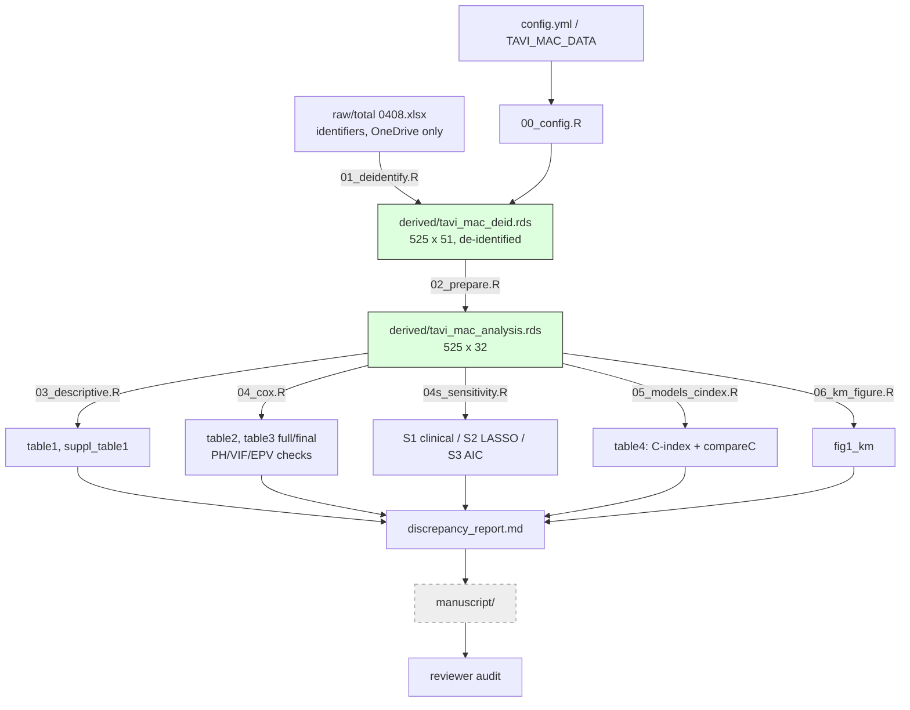

# PROGRESS — TAVI_MAC

**Resume point (for next computer):** Amendments 1+2 executed; analysis stage
COMPLETE. All decisions resolved (continuous primary; binary No-MAC-vs-MAC
presentation; 1-year period HRs for the PH violation; MR grade recoded to
No/I/II/III/IV with half-grades mapped down). Key finding: MAC effect is
confined to the first year (binary HR 3.63 in 0-1 y vs 0.99 after; interaction
p=0.003). Next step: manuscript drafting (Methods/Results) from
`<data_dir>/output/` — table1_binary, table2, table3c_final, table3c_binary,
table_time_interval, table4c, fig1_km_binary, fig2_spline (+ supplements).

## Checklist

### Stage 0 — Infrastructure (plan/setup_infra_plan.md)
- [x] Plan approved (2026-08-31)
- [x] Data moved out of repo to `~/OneDrive/Research/data/TAVI_MAC/raw/`
- [x] Config mechanism (`config/config.yml` + `TAVI_MAC_DATA` env var, `00_config.R`)
- [x] De-identification script `01_deidentify.R` run → `derived/tavi_mac_deid.rds`
- [x] git init, initial commits, pushed to GitHub (jiwonseo1430/TAVI_MAC)

### Stage 1 — Analysis plan
- [x] `plan/analysis_plan.md` written (primary = backward selection; S1–S3 sensitivity)
- [x] Plan approved (2026-08-31)

### Stage 2 — Analysis (all outputs in `<data_dir>/output/`)
- [x] `02_prepare.R` — analysis dataset (525 x 32), MAC group 269/220/36 verified
- [x] `03_descriptive.R` — table1.csv, suppl_table1.csv
- [x] `04_cox.R` — table2.csv, backward selection (table3_full/final.csv), PH/VIF/EPV
- [x] `04s_sensitivity.R` — S1/S2/S3 (sensitivity_models.csv)
- [x] `05_models_cindex.R` — table4.csv (C 0.708→0.732, ΔC p=0.061)
- [x] `06_km_figure.R` — fig1_km.png/.pdf (log-rank p<0.0001)
- [x] discrepancy_report.md (A.fib inversion, T3-2 CI typos, MR n=514, ΔC p)
- [ ] MR-grade handling decision (discrepancy 1c) — blocks Table 1 finalization

### Stage 2b — Amendment 1: continuous MAC exposure (plan Amendment 1)
- [x] 717.2 provenance established: cohort-derived maxstat cutpoint (adj p=0.012)
- [x] `02/03` updated — log2_mac, median-split groups (269/128/128), table1_medgroup
- [x] `07_continuous_primary.R` — primary log2 MAC HR 1.09 (1.04-1.15)/doubling;
      median-split Low 1.87 / High 2.02; S1-S3 all significant; C 0.719→0.736
      (p=0.197) / →0.740 categorical (p=0.085); nonlinearity p=0.008
- [x] `08_figures_continuous.R` — fig1_km_med (log-rank p=0.021), fig2_spline
- [x] PH violation of MAC exposure (p=0.016/0.023) — resolved by Amendment 2

### Stage 2c — Amendment 2: binary presentation, period HRs, MR recode
- [x] MR grade recoded No/I/II/III/IV = 262/210/39/12/2 (half-grades down; no exclusions)
- [x] `03` — table1_binary.csv (manuscript Table 1), 5-level MR in all new tables
- [x] `07` — adjusted binary model: MAC vs No MAC HR 1.94 (1.28-2.95)
- [x] `08` — fig1_km_binary (main; log-rank p=0.006); fig1_km_med -> supplement
- [x] `09_time_interval.R` — 0-1 y vs >1 y: log2 MAC 1.16 vs 0.99 (int p=0.004);
      binary 3.63 (1.96-6.74) vs 0.99 (0.54-1.80) (int p=0.003)

### Stage 2d — post-hoc additions (plan post-hoc log, 2026-09-01)
- [x] 3-interval HRs (0-30d/31-365d/>1y): binary 3.84/3.58/0.99 — first-year
      excess NOT confined to the periprocedural 30 days
- [x] fig3_landmark_3group (manuscript Fig 3): first-year p<0.0001, gradient
      No>Low>High; post-landmark p=0.41. figS_landmark_binary -> supplement
- [x] Figure 1 x-axis capped at 7 years
- [x] fig2_spline re-based to 1-year mortality (log2 MAC HR 1.17, linearity OK);
      whole-period spline -> figS_spline_fullperiod
- [x] `10_period_riskfactors.R` — suppl table: first-year deaths = MAC/CKD/A.fib,
      late deaths = age/STS; median FU 2.59 y observed / 3.18 y reverse-KM

### Stage 3 — Manuscript
- [ ] Draft (Methods/Results first)
- [ ] Reviewer audit (review/reviewer_checklist.md)
- [ ] Submission

## Flow

